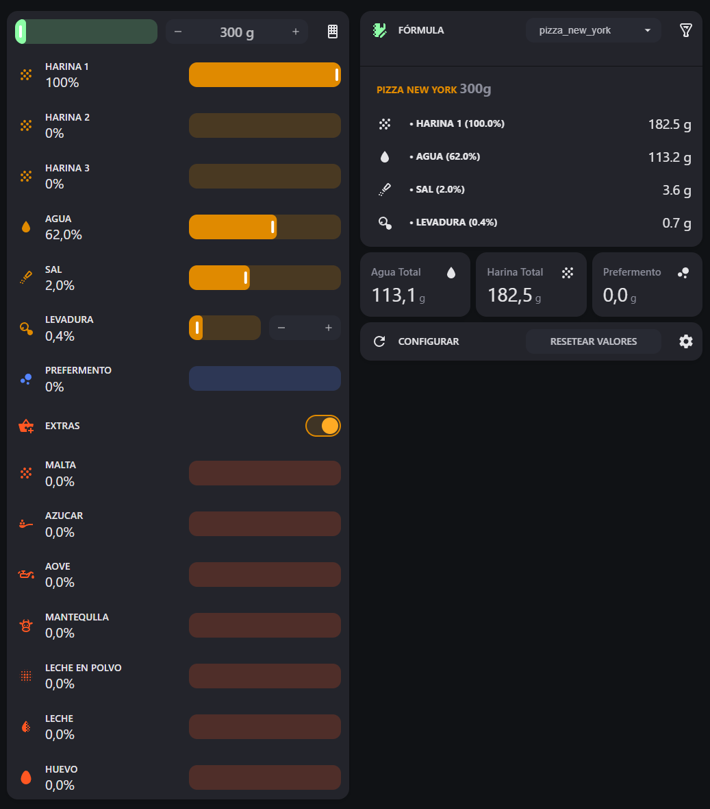
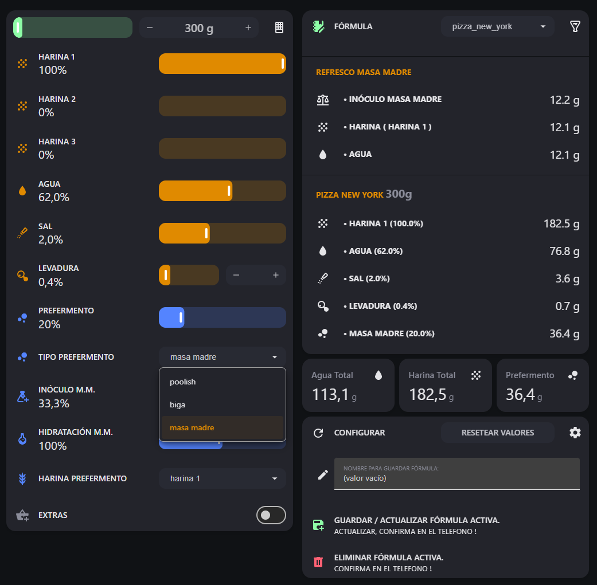
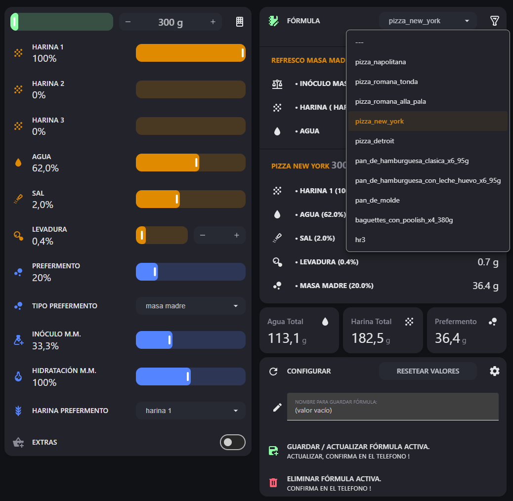
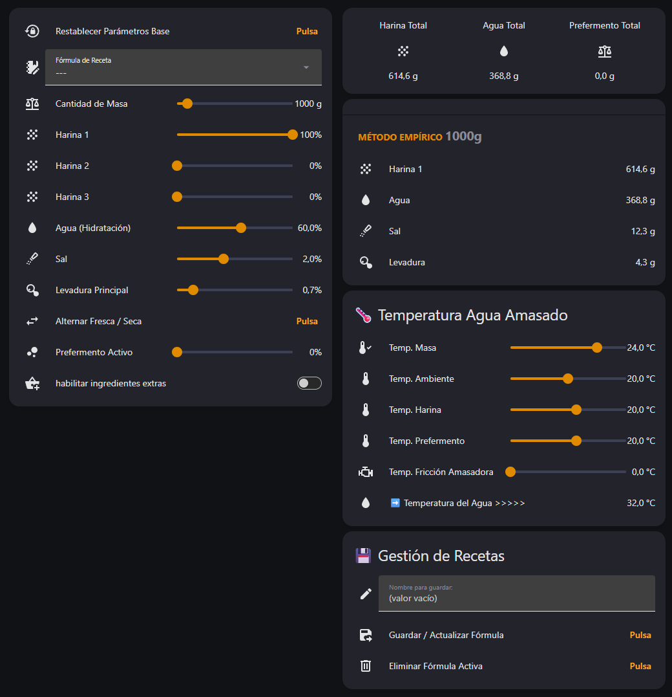
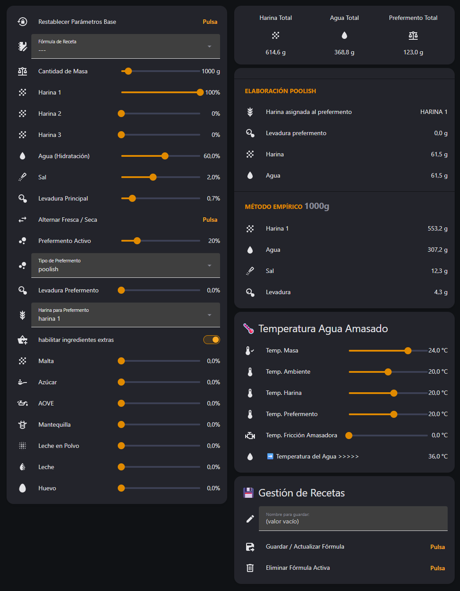

#   Porcentaje Panadero para Home Assistant

Una herramienta interactiva para calcular masas de pan basada en el porcentaje panadero, diseñada específicamente para integrarse en tu panel de Home Assistant.

## ✨ Características principales

*   **Gestión total:** Añade, crea, guarda y modifica tus fórmulas fácilmente.
*   **Doble visualización:** Consúltala directamente desde la tarjeta del dashboard o ábrela en un **popup** (diseñado especialmente para hacer capturas de pantalla limpias).

---

## 📸 Capturas de pantalla

<p align="center">
  
  
  
  
  
</p>

**Porcentaje Panadero** es una integración nativa de alto rendimiento para Home Assistant que transforma tu servidor en un asistente de obrador profesional asíncrono puro. Permite calcular de forma reactiva y en tiempo real los gramos netos de cada ingrediente basándose en el porcentaje panadero y desglosar de forma dinámica elaboraciones complejas con masas madre, poolish o bigas.

---

## 🚀 Características Clave

* **🧠 Motor Algebraico Reactivo:** Introduce la cantidad de masa final (hasta 10kg) y mira cómo oscilan y se recalculan al milisegundo los gramos netos de harinas, agua, sal, levaduras y hasta 7 ingredientes extras enriquecidos (AOVE, mantequilla, huevo, leche...).
* **🍞 Interceptor de Inóculo Avanzado:** Control dinámico e independiente de la masa madre (inóculo) sin alterar la hidratación base del prefermento, o alterandola en base a tus conocimientos . Permite repartos automáticos avanzados (ej. 30g inóculo - 75g harina - 75g agua).
* **📈 Recetario JSON:** Guarda, modifica y elimina tus fórmulas directamente desde la tarjeta visual Lovelace sincronizándose con un archivo `formulas.json` local.
* **📱 Escudo de Confirmaciones Móviles:** Pasarela interactiva bilateral que lanza alertas de confirmación a tu teléfono móvil ante cambios y o borrados accidentales en las formulas.
* **🌡️ Algoritmo Térmico:** Calcula la temperatura ideal del agua del amasado cruzando variables manuales cortas de Lovelace o enlazándose en caliente a tu termómetro Zigbee físico de la cocina.
* **🌐 Nativo & Bilingüe:** Totalmente compatible con la API moderna de Home Assistant Core, ofreciendo traducción automática e independiente en Castellano e Inglés.

## ⚙️ Parámetros de Configuración

Define en gramos la cantidad de **masa final** que deseas y, en porcentaje, el resto de los valores del cálculo.

*   **Inóculo de masa madre:** Cantidad exacta de masa madre activa (de tu tarro de reserva) necesaria para iniciar el prefermento. Se calcula automáticamente según el porcentaje de prefermento seleccionado.
*   **Hidratación de la M.M.:** Porcentaje de agua respecto a la harina en tu masa madre.
*   **Porcentaje de masa madre: Una porcentaje del 33.3% equivale a una proporción 1:1:1 de harina y agua (el refresco tradicional), o un 20% seria un refresco 1:2:2
*   **Harina del prefermento:** Indica de cuál de las harinas de la receta se restará la cantidad destinada al prefermento (por defecto, se descuenta de la Harina 1). El sistema solo te permitirá elegir entre las harinas que hayas activado y estén disponibles.
---

## 📥 Instalación / Installation

### Método 1: HACS (Recomendado / Recommended)

1. Ve a **HACS** en tu Home Assistant.
2. Haz clic en los tres puntos verticales de la esquina superior derecha y selecciona **Repositorios personalizados** (*Custom repositories*).
3. Pega la URL de este repositorio: `https://github.com/DelBierzo/porcentaje_panadero`
4. En **Categoría**, selecciona estrictamente **Integración** (*Integration*) y haz clic en **Añadir** (*Add*).
5. Descarga la versión `1.0.0`, ve a Ajustes y **Reinicia** Home Assistant.
6. Ve a **Ajustes ➔ Dispositivos y servicios ➔ Añadir integración**, busca `Porcentaje Panadero` y configúralo en un clic.

## 🎛️ Arquitectura de Entidades / Entity Architecture

La integración genera de forma automática entidades nativas limpias libres de prefijos duplicados, listas para integrarse en tarjetas `tile`, `custom:expander-card` o `custom:service-call`:

### Controles Deslizantes (Inputs / Sliders)
* `number.masa_final_objetivo` - Peso total de la masa en gramos.
* `number.harina_1` / `_2` / `_3` - Porcentajes individuales de harinas.
* `number.agua_hidratacion` - Porcentaje de agua base.
* `number.sal` - Porcentaje de sal.
* `number.levadura` - Porcentaje de levadura de la masa principal.
* `number.prefermento` - Porcentaje de masa destinada a prefermento.
* `number.inoculo_masa_madre` - % de inóculo dentro de la masa madre (deslizador dinámico).
* `number.hidratacion_masa_madre` - % de hidratación propia de tu masa madre.
* `number.temperatura_ambiente` - Control térmico manual (si no usas sensor físico).

### Sensores de Peso Neto (Outputs / Scale sensors)
* `sensor.porcentaje_panadero_harina_total` - Harina total necesaria en el lote.
* `sensor.porcentaje_panadero_agua_total` - Agua total necesaria en el lote.
* `sensor.porcentaje_panadero_harina_1_neta` / `_2_neta` / `_3_neta` - Harina neta a pesar en el bol principal.
* `sensor.porcentaje_panadero_agua_neta` - Agua neta a pesar en el bol principal.
* `sensor.porcentaje_panadero_inoculo_masa_madre` - Gramos de masa madre activa del bote.
* `sensor.porcentaje_panadero_harina_prefermento` - Harina para refrescar/alimentar el prefermento.
* `sensor.porcentaje_panadero_agua_prefermento` - Agua para refrescar/alimentar el prefermento.
* `sensor.porcentaje_panadero_temperatura_agua_ideal` - Temperatura exacta a la que debe entrar el agua del grifo.

---

## 📱 Configuración Móvil Interactiva (Packages / Automations)

Para habilitar las alertas interactivas de confirmación y blindaje bilateral ante borrados accidentales en tu teléfono, puedes añadir el siguiente Package YAML en tu configuración unificada (`action:` syntax compliant):

```yaml
automation:
  - id: porcentaje_panadero_alerta_borrado_movil
    alias: "Panadero: Alerta Movil de Confirmacion de Borrado"
    trigger:
      - platform: event
        event_type: porcentaje_panadero_alerta_eliminar
    action:
      - action: notify.notify
        data:
          title: "⚠️ ¿Eliminar Receta Activa?"
          message: "Estas a punto de borrar definitivamente la formula: **{{ trigger.event.data.nombre }}**. ¿Deseas proceder?"
          data:
            actions:
              - action: "PAN_CONFIRMAR_BORRADO"
                title: "🗑️ Si, Eliminar"
              - action: "PAN_CANCELAR_BORRADO"
                title: "❌ Cancelar"

  - id: porcentaje_panadero_borrado_confirmado_movil
    alias: "Panadero: Procesar Respuesta de Borrado Móvil"
    trigger:
      - platform: event
        event_type: mobile_app_notification_action
        event_data:
          action: "PAN_CONFIRMAR_BORRADO"
    action:
      - action: porcentaje_panadero.confirmar_eliminacion
```

---

## 🛠️ Desarrollo Local y Contribuciones / Contributions

Si deseas modificar las ecuaciones panaderas de trastienda, optimizar el balanceo reactivo de harinas al 100% o proponer mejoras en la interfaz, eres más que bienvenido a abrir un *Pull Request* o reportar un *Issue*.

### Licencia / License
Este proyecto es software libre y está licenciado bajo los términos de la Licencia MIT.

---

Developed with 🥖 & ☕ by **[@DelBierzo](https://github.com)**.
