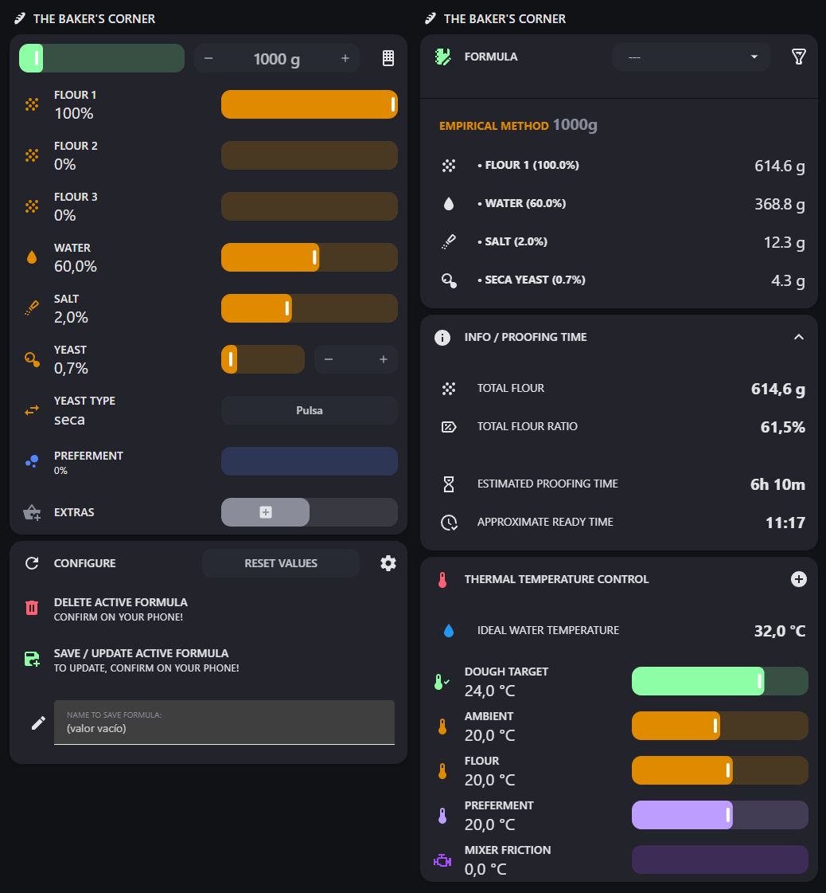
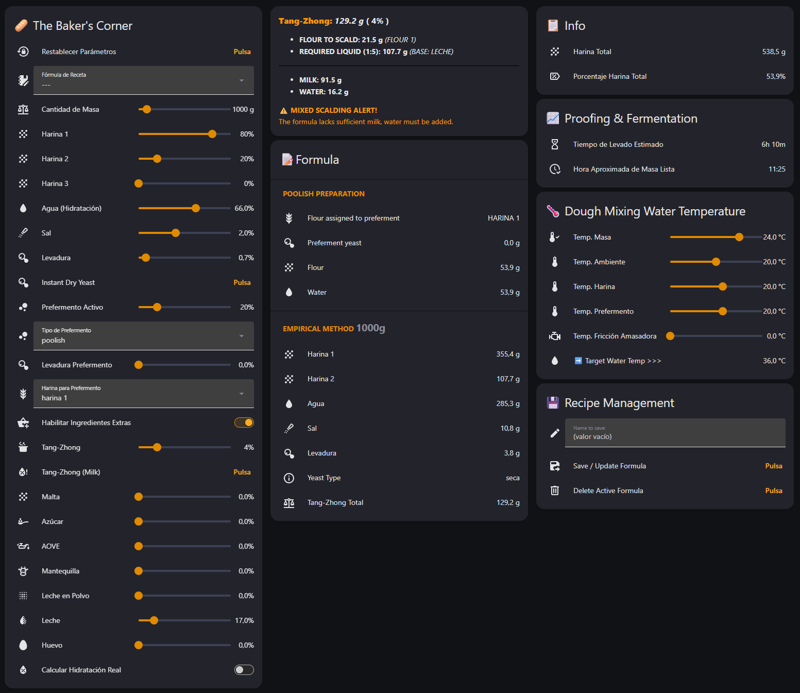

 
  

 
## Porcentaje Panadero / Baker's Percentage (Home Assistant)

Herramienta avanzada para calcular masas de pan basada en el porcentaje panadero, diseñada para integrarse de forma nativa en tu panel de Home Assistant.

---

## 🌐 English Abstract (HACS Compliance)
**Baker's Percentage** is an advanced custom integration for Home Assistant that turns your smart home into a professional bakery station. It dynamically scales flours, liquids, preferments, and extra ingredients based on bakers' percentages, targeting precise final dough weights. It features automated **Tang-Zhong** scaling with mixed-scald milk back-up, hidden liquid compensation (eggs/milk), Arrhenius proofing speed estimations, and local recipe persistence into a JSON file with mobile interactive safety confirmations.

---

## ✨ Características / Features

### 🇪🇸 Castellano
* **Gestión Total:** Añade, crea, guarda y modifica tus fórmulas fácilmente desde la interfaz.
* **Motor Matemático Reactivo:** Introduce la cantidad de masa final (hasta 10 kg) y observa cómo se recalculan al milisegundo los gramos netos de harinas, agua, sal, levaduras e ingredientes enriquecidos.
* **Escaldado Oriental Tang-Zhong / Yudane:** Automatización del engrudo en relación 1:5 descontando la harina y el líquido de la báscula principal con selector dinámico de agua o leche.
* **Escudo Inteligente de Escaldado Mixto:** Si seleccionas base leche para el Tang-Zhong pero la receta se queda sin existencias lácteas, el asistente calcula e inyecta de forma automática agua del grifo a mayores para completar el cazo sin descuadrar la masa final.
* **Compensador de Hidratación Real:** Descuenta y equilibra de forma automática el porcentaje de agua oculta que introducen los huevos batidos y la leche líquida en el bol de amasar.
* **Desglose de Prefermentos Avanzado:** Modelos de cálculo nativos para Poolish, Biga y Masa Madre (refrescos, inóculos e hidrataciones) con asignación y descuento dinámico de harinas netas.
* **Ratio Harina sobre Masa:** Nuevo sensor avanzado que calcula y expone el porcentaje real de la harina total respecto al peso neto de la masa en el bol.
* **Algoritmo Térmico del Agua:** Calcula la temperatura ideal del agua de amasado cruzando variables manuales de fricción o enlazándose en tiempo real a tu termómetro Zigbee físico de la cocina.
* **Recetario Local con Confirmaciones Móviles:** Se sincroniza automáticamente con un archivo `formulas.json` local. Lanzamiento de alertas interactivas a tu smartphone ante sobreescrituras o borrados accidentales.
* **Algoritmo Térmico de Doble Vía:** Calcula la temperatura ideal del agua de amasado monitorizando de forma constante tu cocina (vía termómetro físico Zigbee), mientras que el tiempo de fermentación se calcula de forma independiente según el entorno elegido (encimera real o slider manual para consigna de cámara).
* **Cinética Biológica Exponencial:** Integra un motor de estimación de levado basado en las curvas termodinámicas reales de Arrhenius (Van 't Hoff). Ofrece predicciones exactas tanto a temperatura ambiente estándar de obrador (24°C) como en aletargamiento de frío extremo en nevera (5°C) para fermentaciones prolongadas.

---

### 🇬🇧 English
* **Total Management:** Easily add, create, save, and modify your formulas from the interface.
* **Reactive Math Engine:** Enter the final dough mass (up to 10 kg). Watch net grams of flour, water, salt, yeast, and enriched ingredients recalculate instantly.
* **Tang-Zhong / Yudane Scalding:** Automated roux calculation at a 1:5 ratio. Automatically deducts flour and liquid from the main scale with a dynamic water/milk selector.
* **Smart Mixed-Scalding Shield:** If you choose a milk base for Tang-Zhong but the recipe runs out of dairy, the assistant automatically calculates and adds tap water to complete the mix without altering the final dough weight.
* **True Hydration Compensator:** Automatically discounts and balances hidden water content from beaten eggs and liquid milk in the mixing bowl.
* **Advanced Preferment Breakdown:** Native calculation models for Poolish, Biga, and Sourdough (refreshments, inoculums, and hydration) with dynamic net flour deduction.
* **Flour-to-Dough Ratio:** New advanced sensor that calculates and displays the exact percentage of total flour relative to the net dough weight.
* **Water Thermal Algorithm:** Calculates the ideal water temperature by crossing manual friction variables or syncing in real time with your physical Zigbee kitchen thermometer.
* **Local Recipe Book with Mobile Confirmations:** Syncs automatically with a local `formulas.json` file. Sends interactive smartphone alerts to prevent accidental overwrites or deletions.
* **Dual-Way Thermal Algorithm:** Calculates the ideal kneading water temperature by constantly tracking your physical Zigbee kitchen thermometer, while independently estimating proofing time based on your chosen environment (live counter-top or manual chamber consign slider).
* **Exponential Biological Kinetics:** Integrates a proofing speed engine based on true Arrhenius (Van 't Hoff) thermodynamic curves. It yields highly accurate time predictions for both standard room fermentation (24°C) and extreme cold retardation in fridges (5°C) for extended dough maturations.

---

## 📸 Capturas de Pantalla / Screenshots

  
  

## 🇪🇸 Castellano

## ⚙️ Parámetros de Configuración

Define en gramos la cantidad de **masa final** que deseas y, en **porcentaje**, el resto de los valores del cálculo.

* **Inóculo de Masa Madre:** Cantidad exacta de masa madre activa necesaria para iniciar el prefermento según el porcentaje seleccionado.
* **Hidratación de Masa Madre:** Porcentaje de agua respecto a la harina en tu masa madre de reserva.
* **Porcentaje de Masa Madre:** Un porcentaje del 33.3% equivale a una proporción 1:1:1 (masa madre | harina | agua) del refresco tradicional.
* **Harina del Prefermento:** Indica de cuál de las harinas de la receta se restará la cantidad destinada al prefermento (por defecto, se descuenta de la Harina 1).
* **Control Térmico:** Control de la temperatura final de la masa cruzando ambiente, harina, prefermento y fricción de la amasadora.

---

## 📥 Instalación / Installation

### Método 1: HACS (Recomendado)

1. Ve a **HACS** en tu panel de Home Assistant.
2. Haz clic en los tres puntos verticales de la esquina superior derecha y selecciona **Repositorios personalizados** (*Custom repositories*).
3. Pega la URL de este repositorio: `https://github.com/DelBierzo/porcentaje_panadero`
4. En **Categoría**, selecciona estrictamente **Integración** (*Integration*) y haz clic en **Añadir**.
5. Descarga la última versión, ve a Ajustes y **Reinicia** Home Assistant.
6. Ve a **Ajustes ➔ Dispositivos y servicios ➔ Añadir integración**, busca `Porcentaje Panadero` y configúrala con un solo clic.

---

## 📝 Notas Importantes sobre el Sensor Físico de Temperatura

Si durante la instalación inicial del asistente configuras un **sensor de temperatura físico** (Zigbee, Wi-Fi, etc.) en lugar del slider manual, ten en cuenta el siguiente paso para tu interfaz visual:

* **Modificación de la Tarjeta:** La tarjeta avanzada de Lovelace incluye por defecto deslizadores interactivos manuales (`number.temperatura_...`). Si deseas que el panel muestre la lectura real de tu termómetro físico en lugar del slider, debes editar el código YAML de tu tarjeta avanzada y **reemplazar la entidad del número manual por tu sensor real** (por ejemplo, cambiar `number.temperatura_ambiente` por `sensor.tu_termometro_cocina_temperature`).

## 🎛️ Tarjetas Lovelace (Modos de Uso)

La integración genera de forma automática **78 entidades nativas** que puedes explotar en tu interfaz a través de dos modalidades:

### 🔹 Modo Básico Requisitos: [`tarjeta básica`](https://github.com/DelBierzo/porcentaje_panadero/blob/main/castellano/Tarjeta_Lovelace_Basica.yaml)
Este modo requiere la descarga previa de los siguientes complementos desde **HACS**:

* 📦 [card-mod](https://github.com/thomasloven/lovelace-card-mod) — Personaliza los estilos CSS de las filas.
* 📦 [template-entity-row](https://github.com/thomasloven/lovelace-template-entity-row) — Plantillas avanzadas en las filas de la báscula neta.
 
### 🔸 Modo Avanzado Requisitos: [`tarjeta avanzada`](https://github.com/DelBierzo/porcentaje_panadero/blob/main/castellano/Tarjeta_Lovelace_Avanzada.yaml)
Este modo exprime al máximo la interfaz visual y requiere la descarga previa de los siguientes complementos desde **HACS**:

* 📦 [card-mod](https://github.com/thomasloven/lovelace-card-mod) — Personaliza los estilos CSS de las filas.
* 📦 [template-entity-row](https://github.com/thomasloven/lovelace-template-entity-row) — Plantillas avanzadas en las filas de la báscula neta.
* 📦 [expander-card](https://github.com/MelleD/lovelace-expander-card) — Menús desplegables de la interfaz.
* 📦 [Custom Features for Home Assistant Cards](https://github.com/Nerwyn/custom-card-features) — Características extendidas para los Tiles nativos.
* 📦 [Popup Card](https://github.com/olivierplante/popup-card) — Ventanas flotantes integradas.

#### Activación de la Integración Popup Card
1. Ve a **Ajustes** → **Dispositivos y servicios** → Haz clic en **Añadir integración**.
2. Busca **"Popup Card"** y selecciónala.
3. Haz clic en **Enviar** (esta integración trasera no requiere ninguna configuración adicional).

---

## 🇬🇧 English

## ⚙️ Configuration Parameters

Define the **final dough weight** in grams and the rest of the calculation values in **percentages**.

* **Sourdough Inoculum:** The exact amount of active sourdough starter required to build the preferment based on the selected percentage.
* **Sourdough Hydration:** The percentage of water relative to flour in your mother sourdough culture.
* **Sourdough Percentage:** A percentage of 33.3% equals a traditional 1:1:1 feeding ratio (sourdough culture | flour | water).
* **Preferment Flour:** Specifies from which recipe flour the preferment portion will be subtracted (by default, it is deducted from Flour 1).
* **Thermal Control:** Manages the final dough temperature by crossing variables for ambient, flour, preferment, and mixer friction temperatures.

---

## 📥 Installation

### Method 1: HACS (Recommended)

1. Go to **HACS** in your Home Assistant panel.
2. Click on the three vertical dots in the top right corner and select **Custom repositories**.
3. Paste the URL of this repository: `https://github.com/DelBierzo/porcentaje_panadero`
4. Under **Category**, strictly select **Integration** and click **Add**.
5. Download the latest version, go to Settings, and **Restart** Home Assistant.
6. Go to **Settings ➔ Devices & services ➔ Add integration**, search for `Porcentaje Panadero` and configure it with a single click.

---

## 📝 Important Notes on Physical Temperature Sensors

If you configure a **physical temperature sensor** (Zigbee, Wi-Fi, etc.) during the initial setup instead of using the manual sliders, please note the following step for your dashboard:

* **Dashboard Modification:** The advanced Lovelace card uses manual interactive sliders (`number.temperatura_...`) by default. To display the actual live reading from your physical kitchen thermometer instead of the manual input slider, you must edit your advanced card YAML code and **replace the manual number entity with your actual sensor entity** (e.g., changing `number.temperatura_ambiente` to `sensor.your_kitchen_thermometer_temperature`).

## 🎛️ Lovelace Cards (Usage Modes)

The integration automatically generates **78 native entities** that you can utilize in your dashboard through two different modes:

### 🔹 Basic Mode Requirements: [`basic card`](https://github.com/DelBierzo/porcentaje_panadero/blob/main/english/Lovelace_Basic_Card.yaml)
This mode requires downloading the following frontend cards/plugins from **HACS** beforehand:

* 📦 [card-mod](https://github.com/thomasloven/lovelace-card-mod) — Customize rows CSS styling.
* 📦 [template-entity-row](https://github.com/thomasloven/lovelace-template-entity-row) — Advanced templates in the net scale rows.
  
### 🔸 Advanced Mode Requirements:  [`advanced_card`](https://github.com/DelBierzo/porcentaje_panadero/blob/main/english/Lovelace_Advanced_Card.yaml)
This mode unlocks the full potential of the visual interface and requires downloading the following frontend cards/plugins from **HACS** beforehand:

* 📦 [card-mod](https://github.com/thomasloven/lovelace-card-mod) — Customize rows CSS styling.
* 📦 [template-entity-row](https://github.com/thomasloven/lovelace-template-entity-row) — Advanced templates in the net scale rows.
* 📦 [expander-card](https://github.com/MelleD/lovelace-expander-card) — Manage drop-down menus in the interface.
* 📦 [Custom Features for Home Assistant Cards](https://github.com/Nerwyn/custom-card-features) — Extended button and slider features for native Tiles.
* 📦 [Popup Card](https://github.com/olivierplante/popup-card) — Integrated contextual floating windows.

#### Activating the Popup Card Integration
1. Go to **Settings** → **Devices & services** → Click on **Add integration**.
2. Search for **"Popup Card"** and select it.
3. Click **Submit** (this backend integration requires no further configuration).

---

## 🛠️ Desarrollo Local y Contribuciones / Contributions

Si deseas modificar las ecuaciones panaderas internas o proponer mejoras en la interfaz Lovelace, eres más que bienvenido a abrir un *Pull Request* o reportar un *Issue*.

### Licencia / License
Este proyecto es software libre y está licenciado bajo los términos de la [Licencia MIT](LICENSE).

---

Developed with 🥖 & ☕ by **[@DelBierzo](https://github.com/DelBierzo)**.
