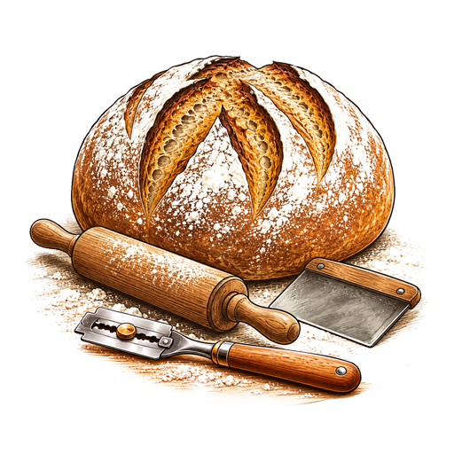

 
  

 
# Porcentaje Panadero para Home Assistant
  
Herramienta avanzada para calcular masas de pan basada en el porcentaje panadero, diseñada para integrarse de forma nativa en tu panel de Home Assistant.

## ✨ Características

* **Gestión Total:** Añade, crea, guarda y modifica tus fórmulas fácilmente desde la interfaz.
* **Doble Visualización:** Consúltala directamente desde la tarjeta del dashboard o ábrela en un **popup** (diseñado especialmente para realizar capturas de pantalla limpias). *Requiere complementos adicionales de HACS.*
* **Motor Matemático:** Introduce la cantidad de masa final (hasta 10 kg) y observa cómo se recalculan al milisegundo los gramos netos de harinas, agua, sal, levaduras y hasta 7 ingredientes extras enriquecidos (AOVE, mantequilla, huevo, leche, etc.).
* **Recetario Local:** Guarda, modifica y elimina tus fórmulas directamente desde la tarjeta visual Lovelace. Se sincroniza automáticamente con un archivo `formulas.json` local.
* **Confirmaciones Móviles:** Pasarela de seguridad que lanza alertas de confirmación a tu teléfono móvil ante cambios o borrados accidentales en las fórmulas.
* **Algoritmo Térmico:** Calcula la temperatura ideal del agua de amasado cruzando variables manuales desde Lovelace o enlazándose en tiempo real a tu termómetro Zigbee físico de la cocina.
* **Nativo & Bilingüe:** Totalmente compatible con la API moderna de Home Assistant Core. Ofrece traducción automática e independiente en castellano e inglés.

> **Porcentaje Panadero** es una integración para Home Assistant que transforma tu servidor en un asistente de obrador profesional asíncrono puro. Permite calcular de forma reactiva y en tiempo real los gramos netos de cada ingrediente basándose en el porcentaje panadero, desglosando de forma dinámica elaboraciones complejas con masas madre, poolish o bigas.

## 📸 Capturas de Pantalla

  
  

## ⚙️ Parámetros de Configuración

Define en gramos la cantidad de **masa final** que deseas y, en **porcentaje**, el resto de los valores del cálculo.

* **Inóculo de Masa Madre:** Cantidad exacta de masa madre activa (de tu tarro de reserva) necesaria para iniciar el prefermento. Se calcula automáticamente según el porcentaje de prefermento seleccionado.
* **Hidratación de Masa Madre:** Porcentaje de agua respecto a la harina en tu masa madre.
* **Porcentaje de Masa Madre:** Un porcentaje del 33.3% equivale a una proporción 1:1:1 (masa madre | harina | agua) del refresco tradicional; un 20% sería un refresco 1:2:2, etc.
* **Harina del Prefermento:** Indica de cuál de las harinas de la receta se restará la cantidad destinada al prefermento (por defecto, se descuenta de la Harina 1). El sistema solo te permitirá elegir entre las harinas que hayas activado y estén disponibles.
* **Control Térmico:** Control de la temperatura final de la masa, donde entran en escena las temperaturas ambiente, de la harina, del prefermento (solo válido si está activado en la fórmula) y de la fricción de la amasadora (si se utiliza).

---

## 📥 Instalación

### Método 1: HACS (Recomendado)

1. Ve a **HACS** en tu panel de Home Assistant.
2. Haz clic en los tres puntos verticales de la esquina superior derecha y selecciona **Repositorios personalizados**.
3. Pega la URL de este repositorio: `https://github.com/DelBierzo/porcentaje_panadero`
4. En **Categoría**, selecciona estrictamente **Integración** y haz clic en **Añadir**.
5. Descarga la última versión, ve a Ajustes y **Reinicia** Home Assistant.
6. Ve a **Ajustes ➔ Dispositivos y servicios ➔ Añadir integración**, busca `Porcentaje Panadero` y configúrala con un solo clic.

---

## ⚠️ Configuración de Avisos y Alertas

Para habilitar la seguridad al eliminar o alterar una fórmula (esta restricción no aplica al crear nuevas), debes añadir la automatización adjunta (`Automation_ES.yaml` para castellano). Esto te permitirá confirmar o denegar la acción directamente desde una notificación interactiva en tu teléfono móvil.

---

## 🎛️ Tarjetas Lovelace (Modos de Uso)

La integración genera de forma automática **53 entidades nativas** que puedes explotar en tu interfaz a través de dos modalidades:

### 🔹 Modo Básico (`Tarjeta_Lovelace_Card_v1_Basic.yaml`)
Instala la integración, añade el código de la tarjeta básica a tu panel y ¡listo para usar! No requiere ninguna dependencia adicional.

### 🔸 Modo Avanzado (`Tarjeta_Lovelace_Card_v2_Advanced.yaml`)
Este modo exprime al máximo la interfaz visual y requiere la descarga previa de los siguientes complementos desde **HACS**:

* 📦 [card-mod](https://github.com/thomasloven/lovelace-card-mod) — Permite personalizar los estilos CSS de la tarjeta.
* 📦 [expander-card](https://github.com/MelleD/lovelace-expander-card) — Gestiona los menús desplegables de la interfaz.
* 📦 [template-entity-row](https://github.com/thomasloven/lovelace-template-entity-row) — Permite usar plantillas avanzadas en las filas de entidades.
* 📦 [Custom Features for Home Assistant Cards](https://github.com/Nerwyn/custom-card-features) — Añade características extendidas a las tarjetas nativas.
* 📦 [Popup Card](https://github.com/olivierplante/popup-card) — Necesario para la correcta visualización de la ventana flotante.

#### Activación de la Integración Popup Card
1. Ve a **Ajustes** → **Dispositivos y servicios** → Haz clic en **Añadir integración**.
2. Busca **"Popup Card"** y selecciónala.
3. Haz clic en **Enviar** (esta integración trasera no requiere ninguna configuración adicional).

---

## 🛠️ Desarrollo Local y Contribuciones / Contributions

Si deseas modificar las ecuaciones panaderas internas, optimizar el balanceo reactivo de harinas al 100% o proponer mejoras en la interfaz Lovelace, eres más que bienvenido a abrir un *Pull Request* o reportar un *Issue*.

### Licencia / License
Este proyecto es software libre y está licenciado bajo los términos de la [Licencia MIT](LICENSE).

---

Developed with 🥖 & ☕ by **[@DelBierzo](https://github.com/DelBierzo)**.
